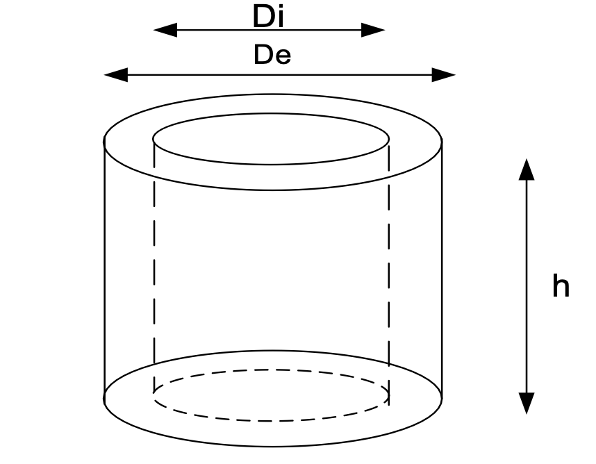

# Introducci\'on
uno o dos parrafos explicando que hay en este informe

# M\'etodos y Materiales
Materiales son:
- Vernier/ Calibrador
- Cilindro hueco

Medir algunas cosas del cilindro, ver figura  \autoref{fig:example} (tomada de referencia [@UMSS_LabFisica])

# Referencias

